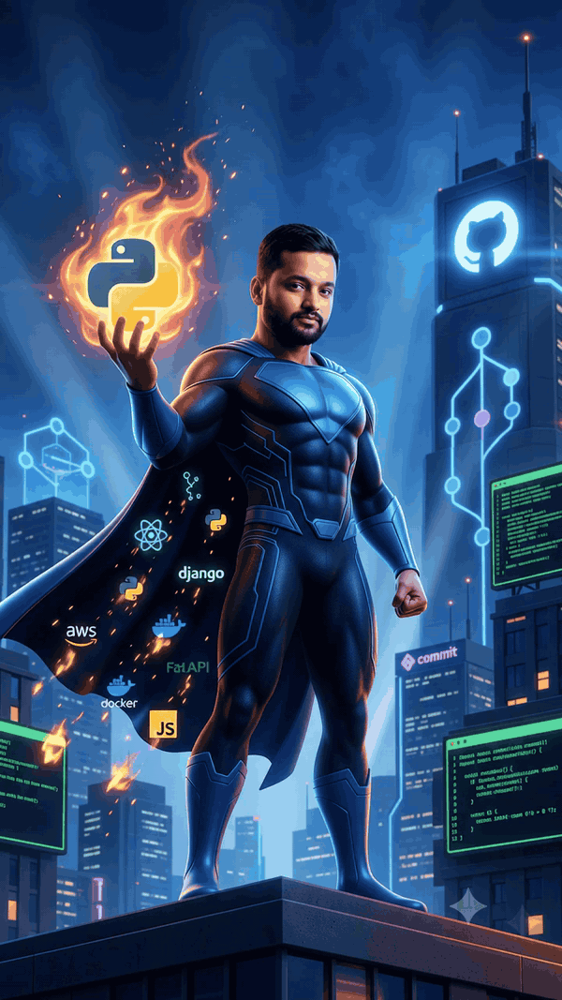

<!--
  ╔══════════════════════════════════════════════════════════════════════╗
  ║  PROFILE README TEMPLATE  ·  one file, four profiles                  ║
  ║  Do not edit this file directly — edit profiles.json and run fill.py  ║
  ╚══════════════════════════════════════════════════════════════════════╝
  Tokens filled by fill.py:
    NAME USERNAME ROLE ACCENT ACCENT2 COMPANY_LINE
    TAGLINE_LINE  (whole <em> line, or blank)
    SOCIALS       (assembled badge <a> blocks — only the ones with a real value)
    TYPING        (url-encoded, ; separated)
  In profiles.json, leave a social "" to omit its badge.
  Mount point:
    personal account  →  repo  PrasannaKumarPalla/PrasannaKumarPalla      file  README.md
    org account        →  repo  PrasannaKumarPalla/.github          file  profile/README.md
  Assets live in ./assets/  (hero.svg, output.gif, output.mp4) — relative paths only.
  Analytics cards are generated live by free services and proxied by GitHub — no build step.
  Snake / 3D / metrics need the workflows in .github/workflows to run once.
-->

  

<h1 align="center">Prasanna Kumar Palla</h1>

<strong>Sr. AI DevOps Cloud Architect</strong>

  &nbsp;
  

  

---

## &nbsp;⚡&nbsp; About

Infrastructure engineer by trade. Started as a **Systems Engineer**, grew through
infrastructure management services into **cloud architecture** — every layer from the
rack to the control plane.

- 🏗️ &nbsp;**Focus** — AWS landing zones, multi-account isolation, infrastructure-as-code, release automation
- ☁️ &nbsp;**AWS depth** — Control Tower · Organizations · Account Factory for Terraform (AFT) · EC2 · RDS / Aurora · Lambda · Athena · VPC · IAM Identity Center &nbsp;(+ GCP / Azure exposure)
- 🛠️ &nbsp;**Build with** — Terraform · Python · FastAPI · React · Docker · Kubernetes · GitHub Actions
- 🤖 &nbsp;**Now** — multi-tenant platforms and LLM / agent systems in production: RAG, vector search, evals, guardrails
- 🌱 &nbsp;**Learning** — platform engineering at scale, agent orchestration, distributed systems design
- 💬 &nbsp;**Ask me about** — landing zones, account vending, IaC, CI/CD, cost control, LLM apps, system design
- 📫 &nbsp;**Reach me** — pallaprasannakumar02@gmail.com

---

## &nbsp;🧰&nbsp; Skills

<table>
  <tr>
    <td valign="top"><strong>Cloud&nbsp;&amp;&nbsp;Infra</strong></td>
    <td></td>
  </tr>
  <tr>
    <td valign="top"><strong>Backend</strong></td>
    <td></td>
  </tr>
  <tr>
    <td valign="top"><strong>Frontend</strong></td>
    <td></td>
  </tr>
  <tr>
    <td valign="top"><strong>Databases</strong></td>
    <td></td>
  </tr>
  <tr>
    <td valign="top"><strong>AI&nbsp;/&nbsp;ML</strong></td>
    <td></td>
  </tr>
  <tr>
    <td valign="top"><strong>CI/CD&nbsp;&amp;&nbsp;Tools</strong></td>
    <td></td>
  </tr>
</table>

  
  
  
  
  
  
  
  
  
  

---

## &nbsp;🎬&nbsp; In motion

  

<!-- Prefer video (sharper, ~1.7 MB)? Delete the  above and use:

  <video src="https://github.com/PrasannaKumarPalla/PrasannaKumarPalla/raw/main/assets/output.mp4"
         width="320" autoplay loop muted playsinline></video>

-->

---

## &nbsp;📊&nbsp; GitHub Analytics

<!-- summary cards — vn7n24fzkq/github-profile-summary-cards -> output/github_dark/ .
     Only the 3 cards that don't query the `email` field: PROFILE_TOKEN has repo+read:org but
     not read:user, so 0-profile-details and 3-stats fail. Add read:user to that PAT to use them. -->

  
  
  

<!-- contribution game — Space Shooter GIF, committed by the `contribution game` workflow -->

  

<!-- streak — live service -->

  

views&nbsp;
  

